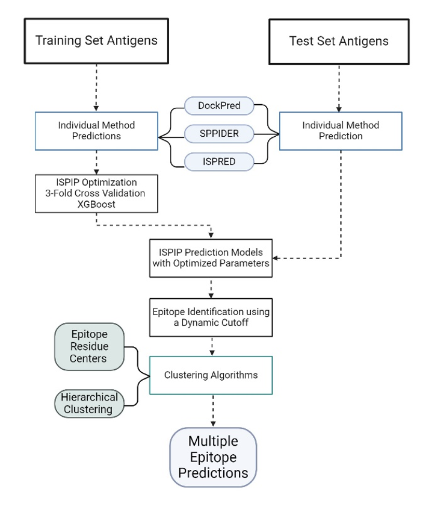

# ISPIPab: Computational Prediction of Multiple Antigen Epitopes

<p> Manuscript by R. Viswanathan, M. Carroll, A. Roffe, J.E. Fajardo, A. Fiser </p>

---

### Abstract: 

__Motivation__
<p>Identifying antigen epitopes is essential in medical applications, such as immunodiagnostic reagent discovery, vaccine design, and drug development. Computational approaches can complement low-throughput, time-consuming, and costly experimental determination of epitopes. Currently available prediction methods, however, have moderate success predicting epitopes, which limits their applicability. Epitope prediction is further complicated by the fact that multiple epitopes may be located on the same antigen and complete experimental data is often unavailable.</p>

__Results__
<p> Here, we introduce the antigen epitope prediction program ISPIPab that combines information from two feature-based methods and a docking-based method. We demonstrate that ISPIPab outperforms each of its individual classifiers as well as other state-of-the-art methods, including those designed specifically for epitope prediction. By combining the prediction algorithm with hierarchical clustering, we show that we can effectively capture epitopes that align with available experimental data while also revealing additional novel targets for future experimental investigations. </p>

---


__Description__

HIV-1 GP120 with the two experimentally identified epitopes (in pink). The figure on the left shows the antigen complex with ADCC-potent antibody N60-i3 Fab (PDB ID: 5KJR). while the figure on the right shows the antigen complex with a broadly neutralizing antibody (PDB ID: 4JPW) The epitopal residues predicted by ISPIPab are clustered into Cluster 1 (red) and Cluster 2 (green) and compared with the experimentally identified epitopes (pink).

---
<h3> ISPIPab Overview: </h3>

ISPIPab was developed using 111 non-redundant and diverse unbound antigen structures, 82 of which were used for training through three-fold CV and 29 of which were used for testing, with the input and output data available in this repository. ISPIPab applies its foundational work, ISPIP, combined with a hierarchical clustering methodology to improve antigen epitope prediction. We have previously shown that that the generic protein interface computational prediction is improve by using a combination of methods that rely on orthogonal structure-based properties of a query protein, combining and balancing both template-free and template-based features. 

We further hypothesize in this work that ISPIPab, which presents an approach of combining two generic feature-based methods and a docking-based method, can improve antigen epitope prediction beyond other methods currently available, including those specially designed for epitope prediction. Furthermore, as shown by Liang et al. (2010) and Hu et al. (2014) meta-learning approaches have stronger B-cell epitope predictive performance than single classifiers. However, many previously published methods, including EPMeta, are unavailable for use.

Additionally, computational antigen epitopes prediction is further challenged as antibody-antigen interactions can occur across multiple regions on the surface of an antigen of interest. While it remains unknown whether any region of an antigen’s surface can theoretically be targeted by antibodies, specific regions are targeted much more favorably during immune responses, an immunological phenomenon known as epitope immunodominance. Through ISPIPab's hierarchical clustering methodology, ISPIPab's predicted epitopal residues can be appropriately grouped into distinct epitope regions, allowing for the prediction of immunodominant and subdominant B-cell epitopes.

The following figure overviews ISPIPab's methodology and workflow: 





<h3> Requirements: </h3>

* Python 3.7

<h3>Usage for ISPIPab Epitopal Residue Prediction: </h3>

```shell
pip install ISPIP
ispip -i /path/to/input/file --mode generate
```

<h3>Development: </h3>

```shell
git clone https://github.com/eved1018/ISPIP
cd ISPIP
pip3 install -r requirements.txt
python3 main.py -i /path/to/input/file
```

<h3>Arguments:</h3>

- Input/Output:
	* `-if`: [str] default: None - Directory containing trained models. This folder should contain .joblib files to use as model inputs. 


			| Model    | Name |
			| -------- | ------- |
			| RandomForest  | RF_{model_name}.joblib    |
			| Log Regression  | Logit_{model_name}.joblib    |
			| Lin Regression  | LinRerg_{model_name}.joblib    |
			| XGBoost  | XGB_{model_name}.joblib    |

	* `-of`: [str] default: output - Directory to place output of ISPIP.
	* `-i`: [str] default: input.csv - CSV Filename with columns: "residue","predus","ispred","dockpred","annotated". The column residue is of the form {residue number}_{PDB ID}.{chain}. The annotated column is 1 or interface residue and 0 for non-interface residue
	* `-cv`: [str] default: cv -Directory containing test and train sets for cross-validation. Same csv format as train/test. Filenames should start with train and test
	* `--trainset`: [str] default: test_set.txt - CSV Filename containing proteins for models to train on with columns: protein,size. The column protein is of the form {PDB ID}.{chain}
	* `--testset`: [str] default: train_set.txt - CSV Filename containing proteins for models to test on with columns: protein,size. The column protein is of the form {PDB ID}.{chain}
	* `--cutoffs`: [str] default:'cutoffs.csv' - CSV Filename containing length of interface or precalculated cutoff for each protein. File should have columns: Protein,surface res,cutoff res,annotated res. 
	* `--model-name`: [str] default:'model' - Name of models to import/export. (see -if about)
	* `--results-df`: [str] - path to result file from previous "predict" run to reprocess. (normally named bin_frame.csv)

- Mode selection:
	* `--mode`: ['predict', 'train', 'generate','cv','viz', "reprocess"] default: 'predict'  
		* __predict__: Use pre-trained model in input folder to predict on set.
		* __generate__: Generate a new rf model from a test set without predicting on any data.
		* __train__: Generate a new rf model from a test set and train on a training set (the runs predict).
		* __viz__: Only call the pymol visualization function. (takes --results_df_input and -cv as input)
		* __cv__: Perform cross-validation and hyperparameter tuning of models on split training set, the best models are then used to predict on a designated testing set.  
		* __reprocess__: Generate statistics from a succesful predict run. (takes --results_df_input as input)

- Parameters: 
	* `--rf-trees`: [integer] default: 10 - Scikit learn 'n_estimators' parameter.
	* `--rf-depth`: [integer] default: None - Scikit learn 'max_depth' parameter.
	* `--rf-ccp`: [float] default: 0.0 - Scikit learn 'ccp_alpha' parameter. (https://scikit-learn.org/stable/modules/tree.html#minimal-cost-complexity-pruning).
	* `--autocutoff`: [int] default: 15 - If no cutoff file is used this sets the default interface cutoff value.


- Flags: 
	* `--pymol`: Output pymol session and image of protein with experimental and predicted interfaces overladed. 
	* `-tv`: Output svg image of a randomly sampled tree (for large datasets this can take up a huge amount of time and space) see https://github.com/parrt/dtreeviz for details.
	* `-xg`: Include the use of gradient boosting regression model.


Output:

- `results.csv`: this file contains the fscore, MCC, Roc AUC and PR AUC for each individual method and model. 

- `roc_model.csv` and pr_model.csv: the TRP and FPR by threshold for each individual method and model, can be used to generate specific ROC or PR graphs.

- `fscore_mcc_by_protein`: the individual fscore and mcc for each protein in the test set. 

- `*.joblib`: the trained models from a generate, test or cv run. Move these into the input directory to be used with 'predict' mode. 

- `pairtest.csv`: Comparison of statistical significance between AUCs.
	- top triangle: difference in pairs of AUCs
	- bottom triangle: log(10) of p-values for the difference in pairs of AUCs.
- `proteins`: Directory containing pymol sessions for each protein in the test set.  
- `cvout`: Directory containing the best parameters for each model used in the final prediction, as well as the individual metrics over each cross validation step. 


<h3>Usage for ISPIPab Hierarchical Clustering: </h3>


ISPIPab predictions should be performed first, prior to clustering.


<h3> Requirements: </h3>

* Python 3.7
* ISPIPab bin_frame output file, which contains per-residue epitope probability score for ISPIPab as well as individual classifiers. 

* Cutoff file (part of the initial ISPIPab prediciton input, listing the cutoff value for each antigen)
* PDB files for antigens of interest (to obtain coordinate data)

-INPUT:
Follow guidance in lines 19-31 of ISPIPab_clustering_script.py to provide necessary paths and directories for the script to find the ISPIPab prediction output, cutoff file, PDB files, and desired directory to output the hierarchical clustering results

-OUTPUT:

A dendrogram will be displayed that may be saved.

A local directory will be created to host the clustering results. A sub-directory will be created for each predictor of interest that the clustering is performed on.

This first subdirectory will contain a second subdirectory with the name of each antigen of interest that was clustering is performed on. This subdirectory will contain a list of the predicted residues as well as coordinate data and geometric center data for each of the predicted residues.

The first subdirectory (entitled by predictor name) will also contain additional subdirectories entitled "hierarchical_cluster_X" (where X is 1,2,3,4,or 5). 
This will contain files entitled by the antigen name that list the specific residues that belong to cluster X.

The summary results CSV will provide the number of predicted residues as well as the total number of residues in each cluster, in ascending order.


---
### Updates:
Please Consult the CHANGELOG.md for all updates

